# ArmRobotSpike

Baseado na montagem deste video:
https://www.youtube.com/watch?v=7oUTjTM3tak&feature=youtu.be

<figure>
  
  <figcaption>Todos as peças utilizadas</figcaption>
  
  
  <figcaption>Montagem completa</figcaption>

  
  <figcaption>Montagem completa</figcaption>
  
  
  <figcaption>Montagem completa</figcaption>
</figure>
<figure>
  
  <figcaption>Montagem camera</figcaption>

  
  <figcaption>Montagem camera</figcaption>
  
  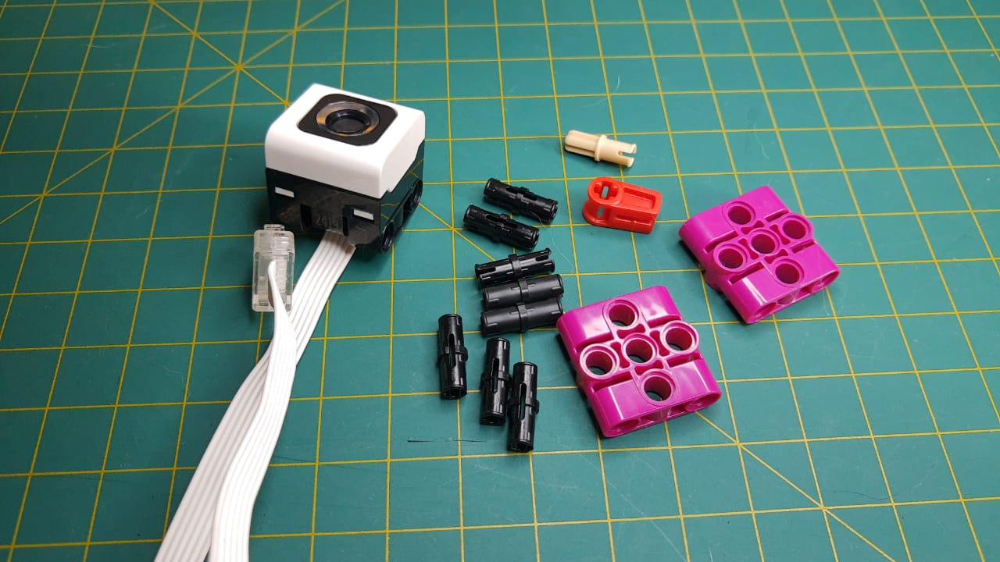
  <figcaption>Montagem camera</figcaption>
</figure>

<figure>
  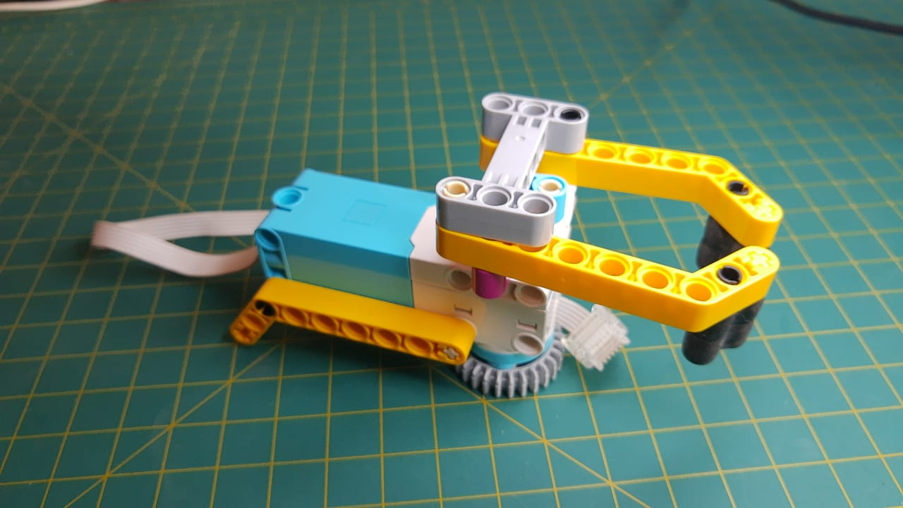
  <figcaption>Montagem garra</figcaption>

  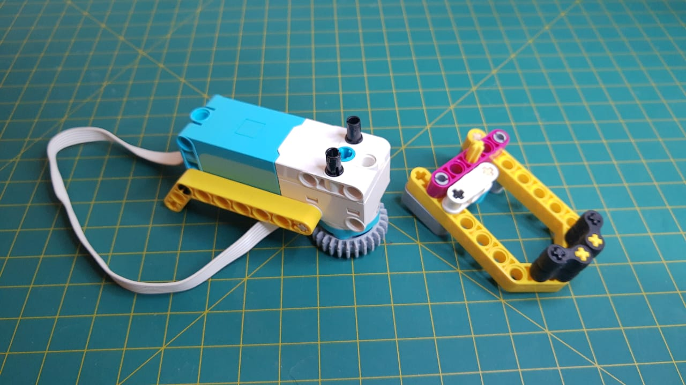
  <figcaption>Montagem garra</figcaption>
  
  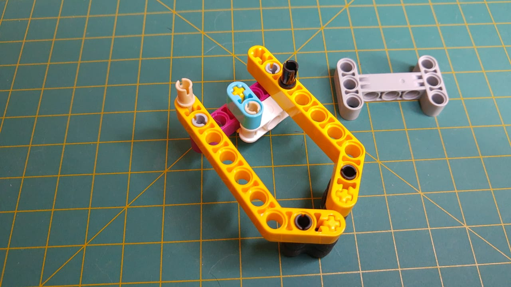
  <figcaption>Montagem garra</figcaption>
  
  
  <figcaption>Montagem garra</figcaption>

  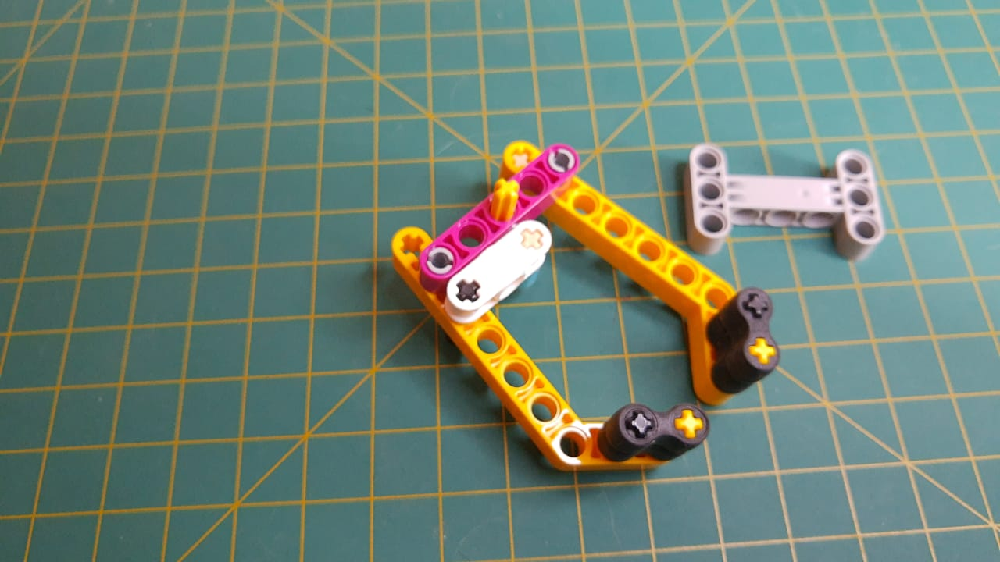
  <figcaption>Montagem garra</figcaption>
  
  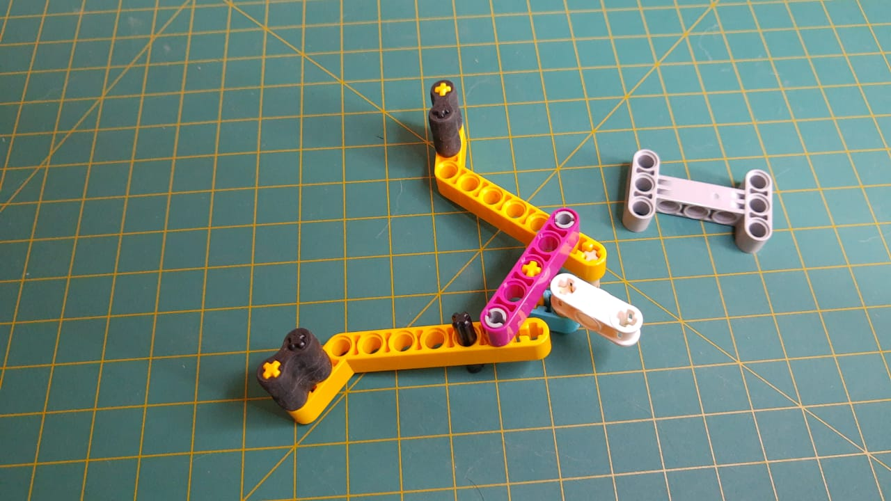
  <figcaption>Montagem garra</figcaption>
  
  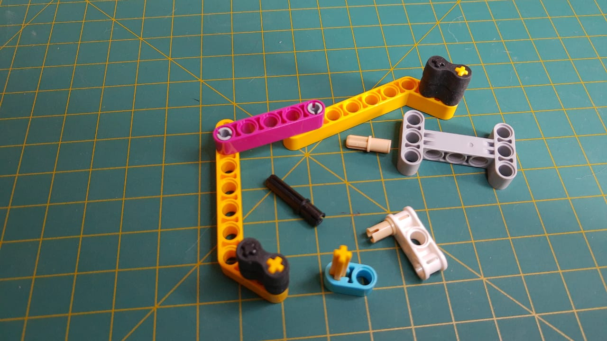
  <figcaption>Montagem garra</figcaption>

  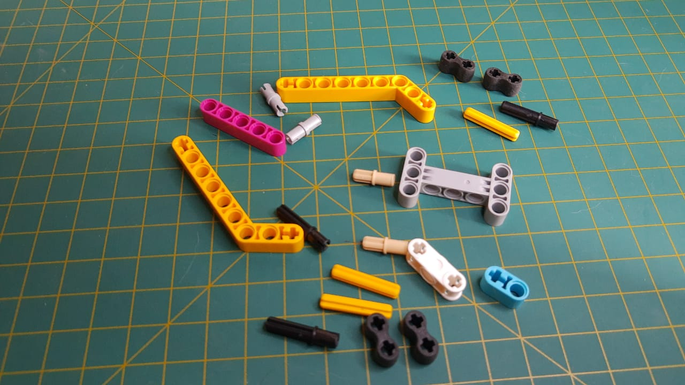
  <figcaption>Montagem garra</figcaption>
  
  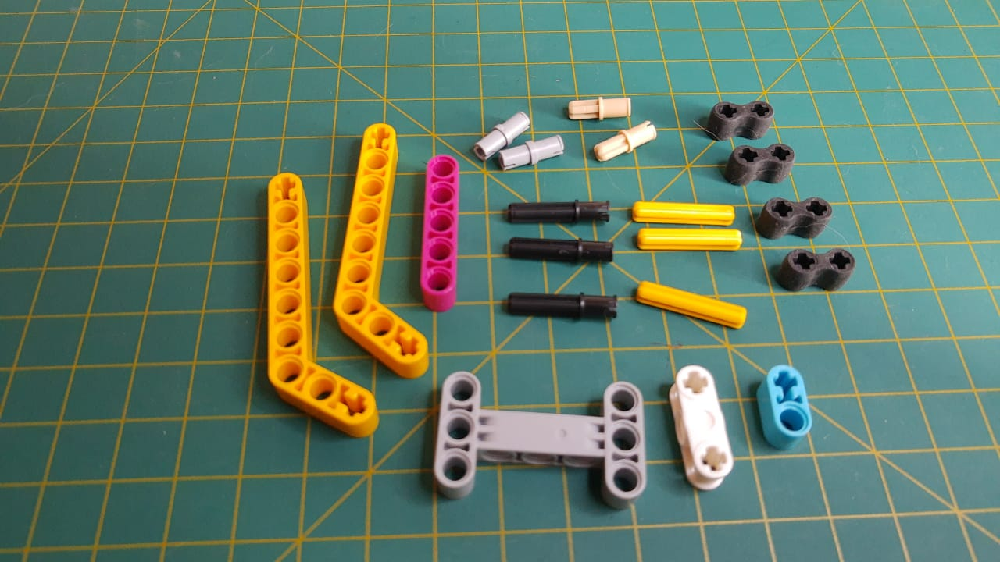
  <figcaption>Montagem garra</figcaption>

  
  <figcaption>Montagem garra</figcaption>

  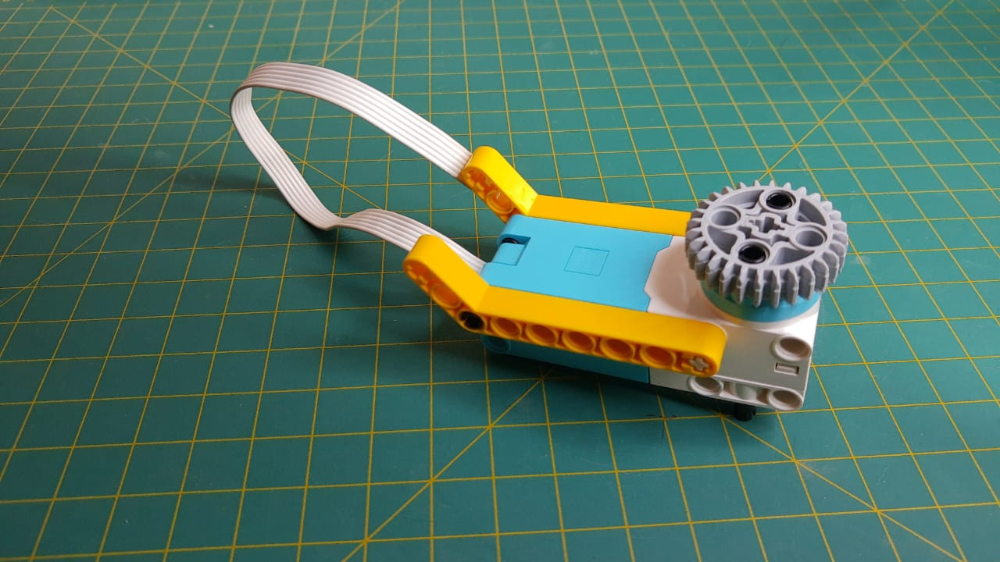
  <figcaption>Montagem garra</figcaption>
  
  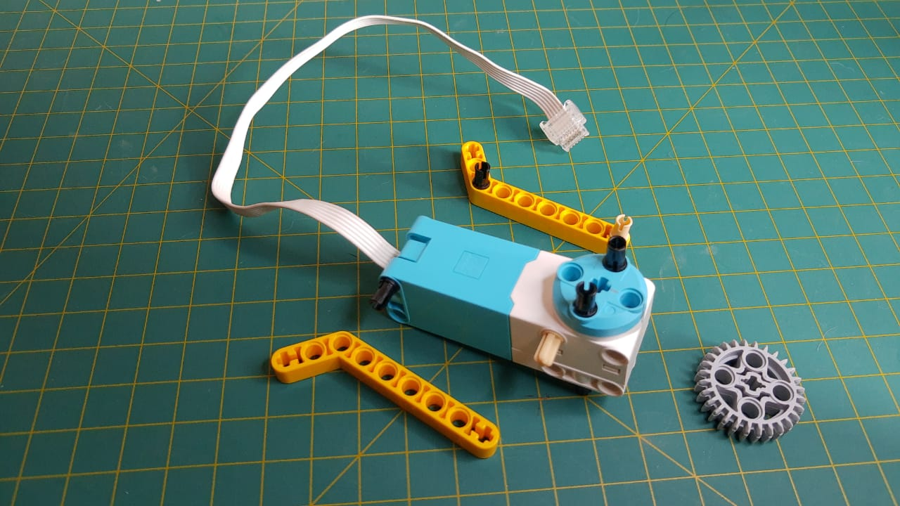
  <figcaption>Montagem garra</figcaption>
  
  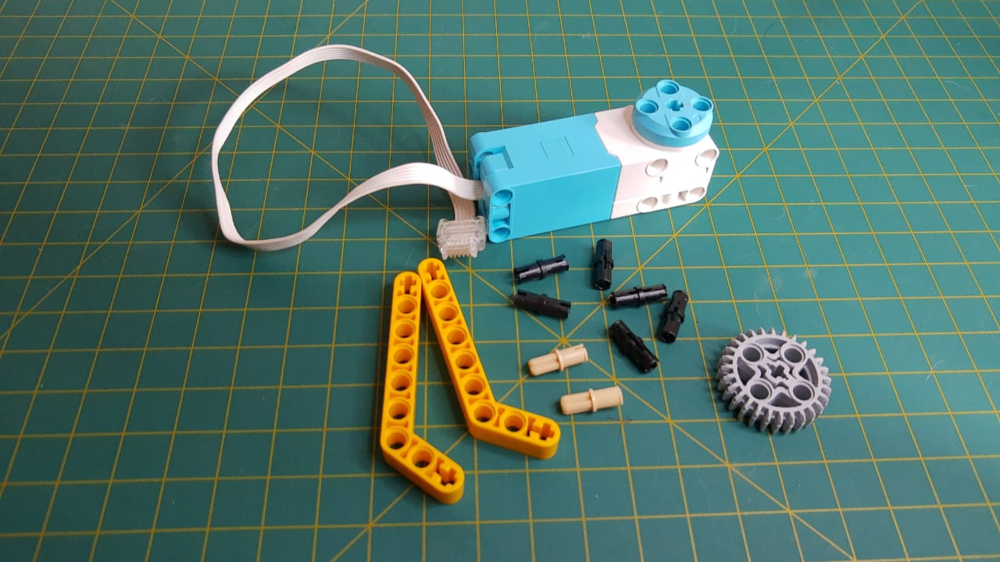
  <figcaption>Montagem garra</figcaption>
</figure>
