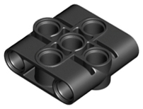
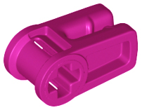
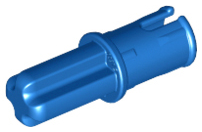
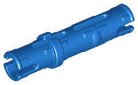

<h1>ArmRobotSpike</h1>

Baseado na montagem deste video:
https://www.youtube.com/watch?v=7oUTjTM3tak&feature=youtu.be

<table style="width:100%">
  <tr>
    <th>ITEM</th>
    <th>QUANTIDADE</th> 
    <th>DESCRIÇÃO</th>
    <th></td>
    <th>ITEM</th>
    <th>QUANTIDADE</th> 
    <th>DESCRIÇÃO</th>
  </tr>
  <tr>
    <td></td>
    <td>1 ud</td>
    <td>HUB</td>
    <td></td>
    <td></td>
    <td>1 ud</td>
    <td>Sensor de Côr</td>
  </tr>
  <tr>
    <td></td>
    <td>1 ud</td>
    <td>Motor grande</td>
    <td></td>
    <td></td>
    <td>2 ud</td>
    <td>Motor pequeno</td>
  </tr>
  <tr>
    <td></td>
    <td>3 ud</td>
    <td>Rodas pequenas</td>
    <td></td>
    <td></td>
    <td>2 ud</td>
    <td>frame 11x15 azuis</td>
  </tr>
  <tr>
    <td></td>
    <td>2 ud</td>
    <td>painel 11x19 amarelo</td>
    <td></td>
    <td></td>
    <td>4 ud</td>
    <td>lift Arm 7x3</td>
  </tr>
  <tr>
    <td></td>
    <td>2 ud</td>
    <td>Beam 7M</td>
    <td></td>
    <td></td>
    <td>2 ud</td>
    <td>Beam 15M</td>
  </tr>
  <tr>
    <td></td>
    <td>2 ud</td>
    <td>Lift Arm 7x3x3</td>
    <td></td>
    <td></td>
    <td>3 ud</td>
    <td>Beam 1x2 Azul</td>
  </tr>
  <tr>
    <td></td>
    <td>2 ud</td>
    <td>Gear 28</td>
    <td></td>
    <td></td>
    <td>1 ud</td>
    <td>Conexão H 3x5</td>
  </tr>
  <tr>
    <td></td>
    <td>1 ud</td>
    <td>Panel 13x11</td>
    <td></td>
    <td></td>
    <td>1 ud</td>
    <td>Beam 5M</td>
  </tr>
  <tr>
    <td></td>
    <td>5 ud</td>
    <td>Biscuit Magenta</td>
    <td></td>
    <td></td>
    <td>5 ud</td>
    <td>Biscuit Preto</td>
  </tr>
  <tr>
    <td></td>
    <td>2 ud</td>
    <td>Conector segura cabo</td>
    <td></td>
    <td></td>
    <td>1 ud</td>
    <td>Barra perpendicular 3M</td>
  </tr>
  <tr>
    <td></td>
    <td>4 ud</td>
    <td>Conector borracha</td>
    <td></td>
    <td></td>
    <td>4 ud</td>
    <td>Eixo 3M amarelo</td>
  </tr>
  <tr>
    <td></td>
    <td>3 ud</td>
    <td>Pino 3M com fricção</td>
    <td></td>
    <td></td>
    <td>1 ud</td>
    <td>Pino eixo com fricção</td>
  </tr>
  <tr>
    <td></td>
    <td>9 ud</td>
    <td>Pino eixo sem fricção</td>
    <td></td>
    <td></td>
    <td>72 ud</td>
    <td>Pino com fricção preto</td>
  </tr>
  <tr>
    <td></td>
    <td>2 ud</td>
    <td>Pino sem fricção</td>
    <td></td>
    <td></td>
    <td>1 ud</td>
    <td>Eixo 9M</td>
  </tr>
  <tr>
    <td></td>
    <td>2 ud</td>
    <td>Painel curvo 11x3 azul</td>
    <td></td>
    <td></td>
    <td>5</td>
    <td>Pino 3M com fricção azul</td>
  </tr>
</table>

<h2>PEÇAS UTILIZADAS</h2>

<figure>
  <figcaption>Todos as peças utilizadas</figcaption>
  
</figure>

<h2>MONTAGEM GERAL</h2>

<figure>
  <figcaption>Montagem completa</figcaption>
    

  <figcaption>Montagem completa</figcaption>
  
  
  <figcaption>Montagem completa</figcaption>
  
 </figure>

<h2>MONTAGEM CÂMERA</h2>

<figure>
  <figcaption>Montagem câmera</figcaption>
  
 
  <figcaption>Montagem câmera</figcaption>
  

  <figcaption>Montagem câmera</figcaption>
  
 </figure>

<h2>MONTAGEM GARRA</h2>

<figure>
  <figcaption>Montagem garra</figcaption>
  
  
  <figcaption>Montagem garra</figcaption>
  
  
  <figcaption>Montagem garra</figcaption>
  

  <figcaption>Montagem garra</figcaption>
  
  
  <figcaption>Montagem garra</figcaption>
  
  
  <figcaption>Montagem garra</figcaption>
  

  <figcaption>Montagem garra</figcaption>
  
  
  <figcaption>Montagem garra</figcaption>
  
  
  <figcaption>Montagem garra</figcaption>
  

  <figcaption>Montagem garra</figcaption>
  
</figure>

<h2>MONTAGEM GARRA MOTOR</h2>

<figure>
  <figcaption>Montagem garra</figcaption>
  
  
  <figcaption>Montagem garra</figcaption>
  
  
  <figcaption>Montagem garra</figcaption>
  
  
  <figcaption>Montagem garra</figcaption>
  
 </figure>
 
 <h2>MONTAGEM CONTRAPESO</h2>
 

 <figure>
  <figcaption>Montagem contrapeso</figcaption>
  
 
  <figcaption>Montagem contrapeso</figcaption>
  
 </figure>
 
 <h2>MONTAGEM BRAÇO</h2>
 

 <figure>
  <figcaption>Montagem braço</figcaption>
  
  
  <figcaption>Montagem braço</figcaption>
  

  <figcaption>Montagem braço</figcaption>
  
  
  <figcaption>Montagem braço</figcaption>
  
 </figure>
 
 <h2>MONTAGEM MOTOR BRAÇO</h2>
 

 <figure>
  <figcaption>Montagem Motor Braço</figcaption>
  
  
  <figcaption>Montagem Motor Braço</figcaption>
  
 </figure>
 
 <h2>MONTAGEM BRAÇO E MOTOR</h2>
 

 <figure>
   <figcaption>Montagem Braço e Motor</figcaption>
   
 
   <figcaption>Montagem Braço e Motor</figcaption>
   
   
   <figcaption>Montagem Braço e Motor</figcaption>
   
  
   <figcaption>Montagem Braço e Motor</figcaption>
   
   
   <figcaption>Montagem Braço e Motor</figcaption>
   
 
   <figcaption>Montagem Braço e Motor</figcaption>
   
  
   <figcaption>Montagem Braço e Motor</figcaption>
   
  
   <figcaption>Montagem Braço e Motor</figcaption>
   
  </figure>

  <h2>MONTAGEM MOTOR BASE</h2>
  

  <figure>
   <figcaption>Montagem Motor Base</figcaption>
   
 
   <figcaption>Montagem Motor Base</figcaption>
   
   
   <figcaption>Montagem Motor Base</figcaption>
   
 
   <figcaption>Montagem Motor Base</figcaption>
   
  
   <figcaption>Montagem Motor Base</figcaption>
   
  </figure>

  <h2>MONTAGEM HUB</h2>
  

  <figure>
   <figcaption>Montagem HUB</figcaption>
   
 
   <figcaption>Montagem HUB</figcaption>
   
  </figure>

  <h2>MONTAGEM Estrutura Amarela</h2>
  

  <figure>
   <figcaption>Montagem Estrutura amarela</figcaption>
   
 
   <figcaption>Montagem Estrutura amarela</figcaption>
   
   
   <figcaption>Montagem Estrutura amarela</figcaption>
   
 
   <figcaption>Montagem Estrutura amarela</figcaption>
   
  
  </figure>
  
  <h2>MONTAGEM Estrutura Azul</h2>
  

  <figure>
   <figcaption>Montagem Estrutura azul</figcaption>
   
  
   <figcaption>Montagem Estrutura azul</figcaption>
   
  
   <figcaption>Montagem Estrutura azul</figcaption>
   
 
   <figcaption>Montagem Estrutura azul</figcaption>
   
   
   <figcaption>Montagem Estrutura azul</figcaption>
   
 
  </figure>
  
  <h2>MONTAGEM Estruturas</h2>
  

  <figure>
   <figcaption>Montagem Estruturas</figcaption>
   
  
   <figcaption>Montagem Estruturas</figcaption>
   
 
   <figcaption>Montagem Estruturas</figcaption>
   
  
   <figcaption>Montagem Estruturas</figcaption>
   
 
   <figcaption>Montagem Estruturas</figcaption>
   
  </figure>
