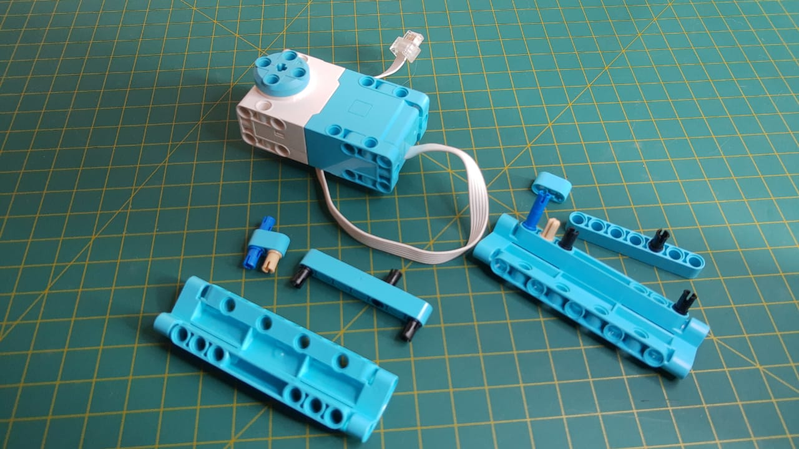
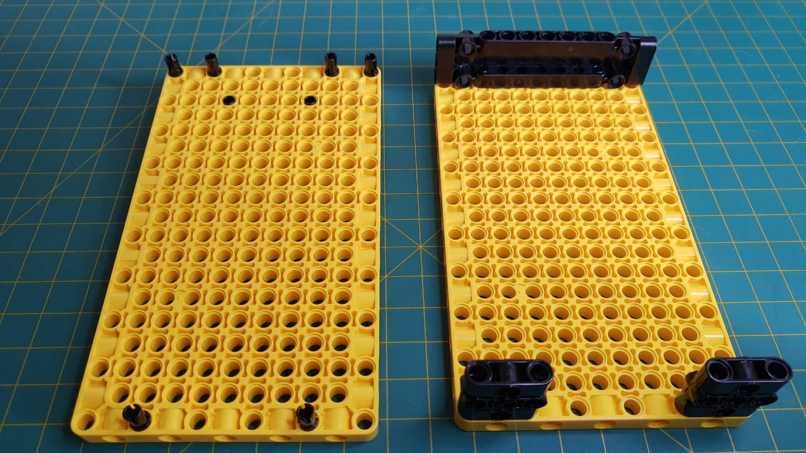

<h1>ArmRobotSpike</h1>

Baseado na montagem deste video:
https://www.youtube.com/watch?v=7oUTjTM3tak&feature=youtu.be

item	descricao	qtd
Large HUB + battery	https://www.bricklink.com/v2/catalog/catalogitem.page?S=45601-1&name=Large%20Hub%20for%20SPIKE%20Prime&category=%5BEducational%20&%20Dacta%5D%5BSPIKE%20Prime%5D#T=S&O={%22iconly%22:0}	1
color sensor	https://www.bricklink.com/v2/catalog/catalogitem.page?S=45605-1&name=Color%20Sensor&category=%5BEducational%20&%20Dacta%5D%5BSPIKE%20Prime%5D#T=S&O={%22iconly%22:0}	1
Large Angular Motor	https://www.bricklink.com/v2/catalog/catalogitem.page?S=45602-1&name=Large%20Angular%20Motor&category=%5BEducational%20&%20Dacta%5D%5BSPIKE%20Prime%5D#T=S&O={%22iconly%22:0}	1
Electric, motor small angular	https://www.bricklink.com/v2/catalog/catalogitem.page?P=54696c01&name=Electric,%20Motor%20Small%20Angular%20-%20Spike%20Prime&category=%5BElectric,%20Motor%5D#T=C	2
Wheel 56 x 14 Technic with Axle Hole and 8 Pin Holes with Fixed Medium Azure Rubber Tire	https://www.bricklink.com/v2/catalog/catalogitem.page?P=39367c01	3
Medium Azure Technic, Liftarm, Modified Frame Thick 11 x 15 Open Center	https://www.bricklink.com/v2/catalog/catalogitem.page?P=39790&idColor=156	2
Yellow Technic, Panel Plate 11 x 19 x 1	https://www.bricklink.com/v2/catalog/catalogitem.page?P=39369&idColor=3	2
Yellow Technic, Liftarm Thick Bent 1 x 9 (7 - 3)	https://www.bricklink.com/v2/catalog/catalogitem.page?P=32271&idColor=3	4
Medium Azure Technic, Liftarm Thick 1 x 7	https://www.bricklink.com/v2/catalog/catalogitem.page?P=32524&idColor=156	2
Black Technic, Liftarm Thick 1 x 15	https://www.bricklink.com/v2/catalog/catalogitem.page?P=32278&idColor=11	2
Black Technic, Liftarm Thick Bent 1 x 11.5 Double	https://www.bricklink.com/v2/catalog/catalogitem.page?P=32009&idColor=11	2
Medium Azure Technic, Liftarm Thick 1 x 2 with Pin Hole and Axle Hole	https://www.bricklink.com/v2/catalog/catalogitem.page?P=60483&idColor=156	3
Light Bluish Gray Technic, Gear 28 Tooth Double Bevel	https://www.bricklink.com/v2/catalog/catalogitem.page?P=46372&idColor=86	2
Light Bluish Gray Technic, Liftarm, Modified Thick H-Shape 3 X 5 Perpendicular	https://www.bricklink.com/v2/catalog/catalogitem.page?P=14720&idColor=86	1
Black Technic, Panel Plate 3 x 11 x 1	https://www.bricklink.com/v2/catalog/catalogitem.page?P=15458&idColor=11	1
Magenta Technic, Liftarm Thick 1 x 5	https://www.bricklink.com/v2/catalog/catalogitem.page?P=32316&idColor=71	1
Magenta Technic, Pin Connector Block, Liftarm 1 x 3 x 3	https://www.bricklink.com/v2/catalog/catalogitem.page?P=39793&idColor=71	5
Black Technic, Pin Connector Block, Liftarm 1 x 3 x 3	https://www.bricklink.com/v2/catalog/catalogitem.page?P=39793&idColor=11	5
Magenta Technic, Axle and Wire Connector	https://www.bricklink.com/v2/catalog/catalogitem.page?P=49283&idColor=71	2
White Technic, Axle and Pin Connector Perpendicular 3L with Center Pin Hole	https://www.bricklink.com/v2/catalog/catalogitem.page?P=32184&idColor=1	1
Black Technic, Axle Connector Double Flexible (Rubber)	https://www.bricklink.com/v2/catalog/catalogitem.page?P=45590&idColor=11	4
Yellow Technic, Axle 3	https://www.bricklink.com/v2/catalog/catalogitem.page?P=4519&idColor=3	4
Blue Technic, Pin 3L with Friction Ridges Lengthwise	https://www.bricklink.com/v2/catalog/catalogitem.page?P=6558&idColor=7	5
Blue Technic, Axle 1 with Pin with Friction Ridges Lengthwise	https://www.bricklink.com/v2/catalog/catalogitem.page?P=43093&idColor=7	1
Tan Technic, Axle 1 with Pin without Friction Ridges Lengthwise	https://www.bricklink.com/v2/catalog/catalogitem.page?P=3749&idColor=2	9
Black Technic, Axle 2 with Pin 3L with Friction Ridges Lengthwise	https://www.bricklink.com/v2/catalog/catalogitem.page?P=18651&idColor=11	3
Light Bluish Gray Technic, Pin without Friction Ridges Lengthwise	https://www.bricklink.com/v2/catalog/catalogitem.page?P=3673&idColor=86	2
Light Bluish Gray Technic, Axle 9	https://www.bricklink.com/v2/catalog/catalogitem.page?P=60485&idColor=86	1
Black Technic, Pin with Friction Ridges Lengthwise, Staggered, with or without Center Slots	https://www.bricklink.com/v2/catalog/catalogitem.page?P=2780&idColor=11	72
Medium Azure Technic, Panel Curved 11 x 3 with 10 Pin Holes through Panel Surface	https://www.bricklink.com/v2/catalog/catalogitem.page?P=11954&idColor=156	2

<h2>MONTAGEM GARRA MOTOR</h2>

<figure>
  
  <figcaption>Todos as peças utilizadas</figcaption>
  
  
  <figcaption>Montagem completa</figcaption>

  
  <figcaption>Montagem completa</figcaption>
  
  
  <figcaption>Montagem completa</figcaption>
</figure>

<h2>MONTAGEM CÂMERA</h2>

<figure>
  
  <figcaption>Montagem câmera</figcaption>

  
  <figcaption>Montagem câmera</figcaption>
  
  
  <figcaption>Montagem câmera</figcaption>
</figure>

<h2>MONTAGEM GARRA</h2>

<figure>
  
  <figcaption>Montagem garra</figcaption>
  
  
  <figcaption>Montagem garra</figcaption>

  
  <figcaption>Montagem garra</figcaption>
  
  
  <figcaption>Montagem garra</figcaption>
  
  
  <figcaption>Montagem garra</figcaption>

  
  <figcaption>Montagem garra</figcaption>
  
  
  <figcaption>Montagem garra</figcaption>
  
  
  <figcaption>Montagem garra</figcaption>

  
  <figcaption>Montagem garra</figcaption>
  
  
  <figcaption>Montagem garra</figcaption>
</figure>

<h2>MONTAGEM GARRA MOTOR</h2>

<figure>
  
  <figcaption>Montagem garra</figcaption>

  
  <figcaption>Montagem garra</figcaption>
  
  
  <figcaption>Montagem garra</figcaption>
  
  
  <figcaption>Montagem garra</figcaption>
 </figure>
 
 <h2>MONTAGEM CONTRAPESO</h2>
 

 <figure>
  
  <figcaption>Montagem contrapeso</figcaption>

  
  <figcaption>Montagem contrapeso</figcaption>
 </figure>
 
 <h2>MONTAGEM BRAÇO</h2>
 

 <figure>
  
  <figcaption>Montagem braço</figcaption>

  
  <figcaption>Montagem braço</figcaption>
  
  
  <figcaption>Montagem braço</figcaption>
  
  
  <figcaption>Montagem braço</figcaption>
 </figure>
 
 <h2>MONTAGEM MOTOR BRAÇO</h2>
 

 <figure>
  
  <figcaption>Montagem Motor Braço</figcaption>

  
  <figcaption>Montagem Motor Braço</figcaption>
 </figure>
 
 <h2>MONTAGEM BRAÇO E MOTOR</h2>
 

 <figure>
  
  <figcaption>Montagem Braço e Motor</figcaption>

  
  <figcaption>Montagem Braço e Motor</figcaption>
  
  
  <figcaption>Montagem Braço e Motor</figcaption>

  
  <figcaption>Montagem Braço e Motor</figcaption>
  
  
  <figcaption>Montagem Braço e Motor</figcaption>
  
  
  <figcaption>Montagem Braço e Motor</figcaption>

  
  <figcaption>Montagem Braço e Motor</figcaption>
  
  
  <figcaption>Montagem Braço e Motor</figcaption>
  </figure>

  <h2>MONTAGEM MOTOR BASE</h2>
  

  <figure>
  
  <figcaption>Montagem Motor Base</figcaption>

  
  <figcaption>Montagem Motor Base</figcaption>
  
  
  <figcaption>Montagem Motor Base</figcaption>

  
  <figcaption>Montagem Motor Base</figcaption>
  
  
  <figcaption>Montagem Motor Base</figcaption>
  </figure>

  <h2>MONTAGEM HUB</h2>
  

  <figure>
  
  <figcaption>Montagem HUB</figcaption>

  
  <figcaption>Montagem HUB</figcaption>
  </figure>

  <h2>MONTAGEM Estrutura Amarela</h2>
  

  <figure>
  
  <figcaption>Montagem Estrutura amarela</figcaption>

  
  <figcaption>Montagem Estrutura amarela</figcaption>
  
  
  <figcaption>Montagem Estrutura amarela</figcaption>

  
  <figcaption>Montagem Estrutura amarela</figcaption>
  </figure>
  
  <h2>MONTAGEM Estrutura Azul</h2>
  

  <figure>
  
  <figcaption>Montagem Estrutura azul</figcaption>

  
  <figcaption>Montagem Estrutura azul</figcaption>
  
  
  <figcaption>Montagem Estrutura azul</figcaption>

  
  <figcaption>Montagem Estrutura azul</figcaption>
  
  
  <figcaption>Montagem Estrutura azul</figcaption>
  </figure>
  
  <h2>MONTAGEM Estruturas</h2>
  

  <figure>
  
  <figcaption>Montagem Estruturas</figcaption>

  
  <figcaption>Montagem Estruturas</figcaption>
  
  
  <figcaption>Montagem Estruturas</figcaption>

  
  <figcaption>Montagem Estruturas</figcaption>
  
  
  <figcaption>Montagem Estruturas</figcaption>
  </figure>
